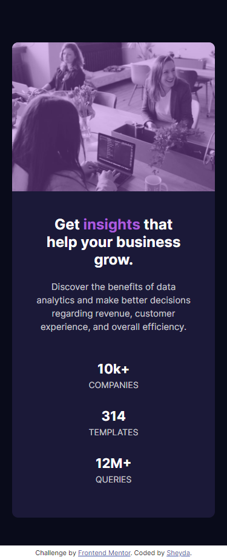

# Frontend Mentor - Stats preview card component solution

This is a solution to the [Stats preview card component challenge on Frontend Mentor](https://www.frontendmentor.io/challenges/stats-preview-card-component-8JqbgoU62). 

## Table of contents

- [Overview](#overview)
  - [The challenge](#the-challenge)
  - [Screenshot](#screenshot)
  - [Links](#links)
  - [Built with](#built-with)
- [Author](#author)

## Overview

### The challenge

Users should be able to:

- View the optimal layout depending on their device's screen size

### Screenshot

Desktop design:

Mobile design:

### Links

- [Solution URL](https://www.frontendmentor.io/solutions/stats-preview-card-component-Ua_vJJsWu)
- [Live Site URL](https://stats-preview-card-component-project.vercel.app/)

## My process

### Built with

- Semantic HTML5 markup
- CSS custom properties
- Flexbox
- Mobile-first workflow

## Author

- Website - [Sheyda Sultanova](https://sheydasultanova.vercel.app/)
- Frontend Mentor - [@sheyda99](https://www.frontendmentor.io/profile/sheyda99)
- LinkedIn- [Sheyda Sultanova](https://www.linkedin.com/in/sheyda-sultanova/)